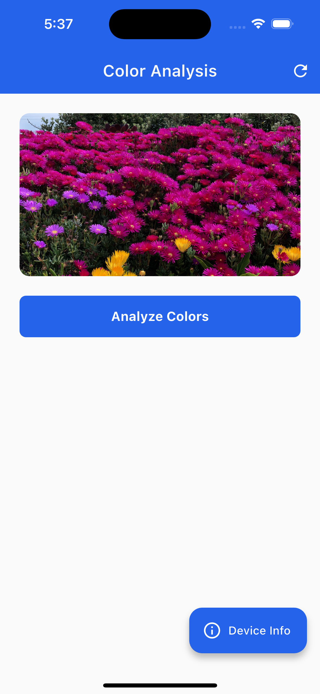

# Color Analysis App

A Flutter application that demonstrates clean architecture, BLoC state management, isolate usage, and platform channels.

## Features

- **Image Capture**: Capture images using device camera or select from gallery
- **Color Analysis**: Process images in isolates
- **Platform Channels**: Native method calls to get device information
- **Clean Architecture**: Well-structured code with separation of concerns
- **BLoC State Management**: Reactive UI with proper state handling
- **Loading Indicators**: Smooth UI experience during processing

## Technical Requirements Met

✅ **Flutter + Dart best practices** - Clean code structure and proper error handling  
✅ **Smooth UI during processing** - Isolates prevent UI freezing  
✅ **Well-structured code** - Clean architecture with proper separation of concerns  
✅ **BLoC state management** - Reactive UI with proper state handling  
✅ **Platform channels** - Native method calls for device information  
✅ **Isolates** - Background processing to simulate AI work

## Project Structure

```
lib/
├── core/
│   └── theme/
│       └── theme.dart
├── features/
│   ├── color_analysis/
│   │   ├── data/
│   │   │   ├── datasources/
│   │   │   │   └── color_analysis_local_data_source.dart
│   │   │   ├── models/
│   │   │   │   └── dominant_color_model.dart
│   │   │   └── repositories/
│   │   │       └── color_analysis_repository_impl.dart
│   │   ├── domain/
│   │   │   ├── entities/
│   │   │   │   └── dominant_color.dart
│   │   │   ├── repositories/
│   │   │   │   └── color_analysis_repository.dart
│   │   │   └── usecases/
│   │   │       └── analyze_image_colors.dart
│   │   └── presentation/
│   │       ├── bloc/
│   │       │   ├── color_analysis_bloc.dart
│   │       │   ├── color_analysis_event.dart
│   │       │   └── color_analysis_state.dart
│   │       ├── pages/
│   │       │   └── color_analysis_page.dart
│   │       └── widgets/
│   │           └── dominant_color_card.dart
│   └── device_info/
│       ├── data/
│       │   ├── services
│       │   │   └── device_info_service.dart
│       │   └── models/
│       │       └── device_info_model.dart
│       ├── domain/
│       │   └── entities/
│       │       └── device_info.dart
│       └── presentation/
│           └── pages/
│               └── device_info_page.dart
├── main.dart
└── service_locator.dart
```

## How to Run

### Prerequisites

- Flutter SDK (3.8.1 or higher)
- Dart SDK
- Android Studio / Xcode (for platform-specific development)
- A physical device or emulator

### Installation Steps

1. **Clone the repository**

   ```bash
   git clone https://github.com/ShishirRijal/color_analaysis.git
   cd color_analaysis
   ```

2. **Install dependencies**

   ```bash
   flutter pub get
   ```

3. **Run the app**
   ```bash
   flutter run
   ```

## Screenshots

<table align="center">
  <tr>
    <td align="center">
      <br/>
      <sub>Home Screen</sub>
    </td>
    <td align="center">
      <br/>
      <sub>Image Selected</sub>
    </td>
  </tr>
  <tr>
    <td align="center">
      <br/>
      <sub>Analysis Result</sub>
    </td>
    <td align="center">
      <br/>
      <sub>Device Info</sub>
    </td>
  </tr>
</table>

### Platform-Specific Setup

#### Android

- Ensure you have Android Studio installed
- Set up an Android emulator or connect a physical device
- The app will request camera and storage permissions when needed

#### iOS

- Ensure you have Xcode installed
- Set up an iOS simulator or connect a physical device
- The app will request camera and photo library permissions when needed

## Usage

1. **Launch the app** - The main screen shows the color analysis interface
2. **Select an image** - Tap the image area to choose between camera or gallery
3. **Analyze colors** - Tap "Analyze Colors" to process the image (simulates 2-second AI processing)
4. **View results** - See the dominant colors with their percentages
5. **Device Info** - Tap the floating action button to view device information via platform channels
6. **Retry** - Use the refresh button to reset and try again

## Key Technical Implementations

### Isolates for Background Processing

```dart
Future<List<DominantColorModel>> _processImageInIsolate(String imagePath) async {
  final receivePort = ReceivePort();

  await Isolate.spawn(_isolateFunction, {
    'sendPort': receivePort.sendPort,
    'imagePath': imagePath,
  });

  final result = await receivePort.first as List<DominantColorModel>;
  return result;
}
```

### Platform Channels

```dart
// Flutter side
static const MethodChannel _channel = MethodChannel('com.np.shishirrijal/device_info');
final info = await _channel.invokeMethod<Map>('getDeviceInfo');

// Native side (Android/iOS)
MethodChannel(flutterEngine.dartExecutor.binaryMessenger, CHANNEL)
  .setMethodCallHandler { call, result ->
    // Handle method calls
  }
```

### BLoC State Management

```dart
class ColorAnalysisBloc extends Bloc<ColorAnalysisEvent, ColorAnalysisState> {
  Future<void> _onAnalyzeImageColors(
    AnalyzeImageColorsEvent event,
    Emitter<ColorAnalysisState> emit,
  ) async {
    emit(ColorAnalysisLoading());
    try {
      final colors = await analyzeImageColors(event.imageFile);
      emit(ColorAnalysisSuccess(colors));
    } catch (e) {
      emit(ColorAnalysisFailure(e.toString()));
    }
  }
}
```

## Dependencies

- `flutter_bloc`: State management
- `equatable`: Value equality
- `image_picker`: Camera and gallery access
- `get_it`: Dependency injection

## Architecture

The app follows Clean Architecture principles:

- **Presentation Layer**: UI components, BLoC, pages, widgets
- **Domain Layer**: Entities, repositories interfaces, use cases
- **Data Layer**: Repository implementations, data sources, models

This ensures:

- Separation of concerns
- Testability
- Maintainability
- Scalability
