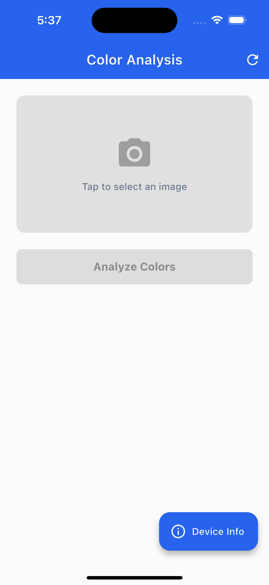
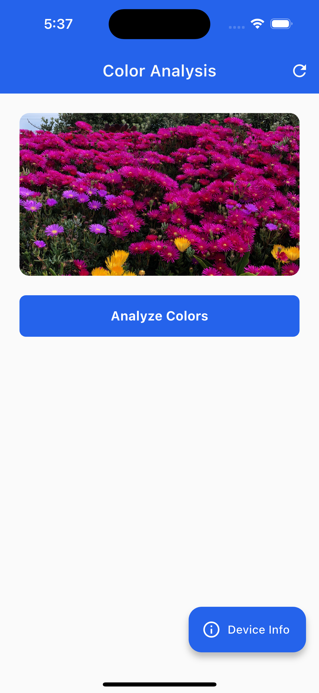
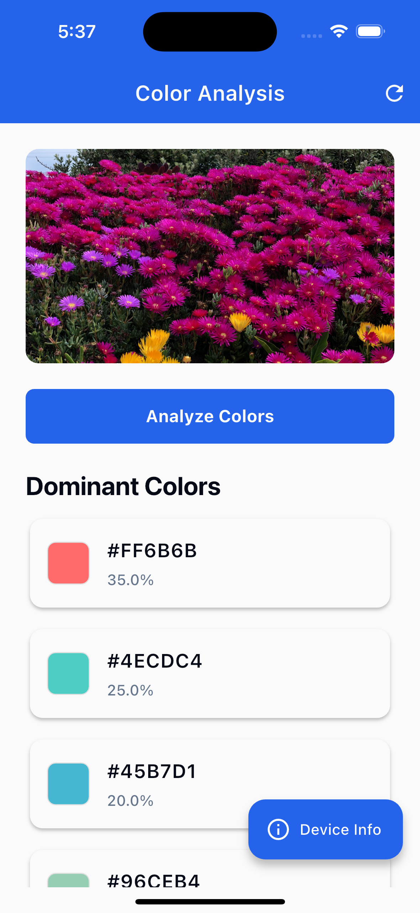
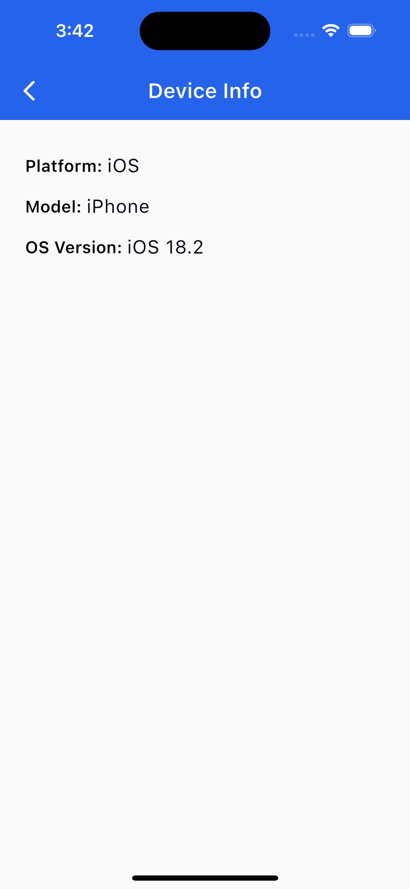

# Color Analysis App

A Flutter application demonstrating **Clean Architecture**, **BLoC state management**, **isolate usage**, and **platform channels** with professional code structure and best practices.

## Features

- **Image Selection**: Capture images via camera or select from gallery
- **Color Analysis**: Extract dominant colors using background isolates
- **Device Information**: Native device info via platform channels
- **Clean Architecture**: Proper separation of concerns across all layers
- **BLoC Pattern**: Reactive state management with proper lifecycle
- **Memory Efficient**: Smart BLoC scoping and resource management

## Architecture Highlights

✅ **Clean Architecture** - Complete 3-layer separation with proper dependencies  
✅ **BLoC State Management** - Both features implement full BLoC pattern  
✅ **Background Processing** - Isolates prevent UI blocking during analysis  
✅ **Platform Channels** - Native method calls for device information  
✅ **Dependency Injection** - GetIt service locator with proper registration

## Project Structure

```
lib/
├── core/
│   └── theme/
│       └── theme.dart                          # App-wide theme configuration
├── features/
│   ├── color_analysis/
│   │   ├── data/
│   │   │   ├── datasources/
│   │   │   │   └── color_analysis_data_source.dart
│   │   │   ├── models/
│   │   │   │   └── dominant_color_model.dart
│   │   │   └── repositories/
│   │   │       └── color_analysis_repository_impl.dart
│   │   ├── domain/
│   │   │   ├── entities/
│   │   │   │   └── dominant_color.dart
│   │   │   ├── repositories/
│   │   │   │   └── color_analysis_repository.dart
│   │   │   └── usecases/
│   │   │       └── analyze_image_colors.dart
│   │   └── presentation/
│   │       ├── bloc/
│   │       │   ├── color_analysis_bloc.dart
│   │       │   ├── color_analysis_event.dart
│   │       │   └── color_analysis_state.dart
│   │       ├── pages/
│   │       │   └── color_analysis_page.dart
│   │       └── widgets/
│   │           └── dominant_color_card.dart
│   └── device_info/
│       ├── data/
│       │   ├── datasources/
│       │   │   └── device_info_data_source.dart
│       │   ├── models/
│       │   │   └── device_info_model.dart
│       │   └── repositories/
│       │       └── device_info_repository_impl.dart
│       ├── domain/
│       │   ├── entities/
│       │   │   └── device_info.dart
│       │   ├── repositories/
│       │   │   └── device_info_repository.dart
│       │   └── usecases/
│       │       └── get_device_info.dart
│       └── presentation/
│           ├── bloc/
│           │   ├── device_info_bloc.dart
│           │   ├── device_info_event.dart
│           │   └── device_info_state.dart
│           └── pages/
│               └── device_info_page.dart
├── main.dart
└── service_locator.dart                        # Dependency injection setup
```

## How to Run

### Prerequisites

- Flutter SDK (3.8.1 or higher)
- Dart SDK
- Android Studio / Xcode (for platform-specific development)
- A physical device or emulator

### Installation Steps

1. **Clone the repository**

   ```bash
   git clone https://github.com/ShishirRijal/color_analaysis.git
   cd color_analaysis
   ```

2. **Install dependencies**

   ```bash
   flutter pub get
   ```

3. **Run the app**
   ```bash
   flutter run
   ```

## Screenshots

<table align="center">
  <tr>
    <td align="center">
      <br/>
      <sub>Home Screen</sub>
    </td>
    <td align="center">
      <br/>
      <sub>Image Selected</sub>
    </td>
  </tr>
  <tr>
    <td align="center">
      <br/>
      <sub>Analysis Result</sub>
    </td>
    <td align="center">
      <br/>
      <sub>Device Info</sub>
    </td>
  </tr>
</table>

### Platform-Specific Setup

#### Android

- Ensure you have Android Studio installed
- Set up an Android emulator or connect a physical device
- The app will request camera and storage permissions when needed

#### iOS

- Ensure you have Xcode installed
- Set up an iOS simulator or connect a physical device
- The app will request camera and photo library permissions when needed

## Usage

1. **Launch the app** - The main screen shows the color analysis interface
2. **Select an image** - Tap the image area to choose between camera or gallery
3. **Analyze colors** - Tap "Analyze Colors" to process the image (simulates 2-second AI processing)
4. **View results** - See the dominant colors with their percentages
5. **Device Info** - Tap the floating action button to view device information via platform channels
6. **Retry** - Use the refresh button to reset and try again

## Key Technical Implementations

### Clean Architecture Pattern

Both features follow the complete 3-layer architecture:

**Domain Layer** (Business Logic)

- Entities: Pure data classes with business rules
- Repositories: Abstract contracts for data access
- Use Cases: Single-responsibility business operations

**Data Layer** (External Concerns)

- Data Sources: Platform-specific implementations
- Models: Data transfer objects with serialization
- Repository Implementations: Concrete data access logic

**Presentation Layer** (UI Logic)

- BLoC: State management with event-driven architecture
- Pages: UI screens with proper separation
- Widgets: Reusable UI components

### BLoC State Management

```dart
// Color Analysis BLoC with image persistence
class ColorAnalysisBloc extends Bloc<ColorAnalysisEvent, ColorAnalysisState> {
  Future<void> _onAnalyzeImageColors(
    AnalyzeImageColorsEvent event,
    Emitter<ColorAnalysisState> emit,
  ) async {
    final currentImage = _getCurrentSelectedImage();
    emit(ColorAnalysisLoading(selectedImage: currentImage));
    try {
      final colors = await analyzeImageColors(event.imageFile);
      emit(ColorAnalysisSuccess(colors, selectedImage: currentImage));
    } catch (e) {
      emit(ColorAnalysisFailure(e.toString(), selectedImage: currentImage));
    }
  }
}
```

### Memory-Efficient BLoC Management

```dart
// Global provider for core feature
BlocProvider(create: (context) => sl<ColorAnalysisBloc>())

// Local provider for occasional features (better memory usage)
Navigator.push(
  MaterialPageRoute(
    builder: (_) => BlocProvider(
      create: (context) => sl<DeviceInfoBloc>()..add(LoadDeviceInfoEvent()),
      child: const DeviceInfoPage(),
    ),
  ),
);
```

### Background Processing with Isolates

```dart
Future<List<DominantColorModel>> _processImageInIsolate(String imagePath) async {
  final receivePort = ReceivePort();
  await Isolate.spawn(_isolateFunction, {
    'sendPort': receivePort.sendPort,
    'imagePath': imagePath,
  });
  return await receivePort.first as List<DominantColorModel>;
}
```

### Platform Channels Integration

```dart
// Data Source Implementation
class DeviceInfoDataSourceImpl implements DeviceInfoDataSource {
  static const MethodChannel _channel = MethodChannel('com.np.shishirrijal/device_info');

  @override
  Future<DeviceInfo> getDeviceInfo() async {
    final info = await _channel.invokeMethod<Map>('getDeviceInfo');
    return DeviceInfoModel.fromNative(Map<String, dynamic>.from(info ?? {}));
  }
}
```

## Dependencies

```yaml
dependencies:
  flutter_bloc: ^8.1.3 # State management
  equatable: ^2.0.5 # Value equality for entities and states
  image_picker: ^1.0.4 # Camera and gallery access
  get_it: ^7.6.4 # Dependency injection
```

## Architecture Benefits

This implementation demonstrates:

**Clean Architecture Principles:**

- ✅ **Dependency Inversion** - High-level modules don't depend on low-level modules
- ✅ **Single Responsibility** - Each class has one reason to change
- ✅ **Separation of Concerns** - UI, business logic, and data access are separated
- ✅ **Testability** - Each layer can be tested independently

**BLoC Pattern Benefits:**

- ✅ **Reactive UI** - UI rebuilds only when state changes
- ✅ **Predictable State** - Clear state transitions and error handling
- ✅ **Memory Efficiency** - Smart provider scoping based on usage patterns
- ✅ **Scalability** - Easy to add new features following the same pattern
